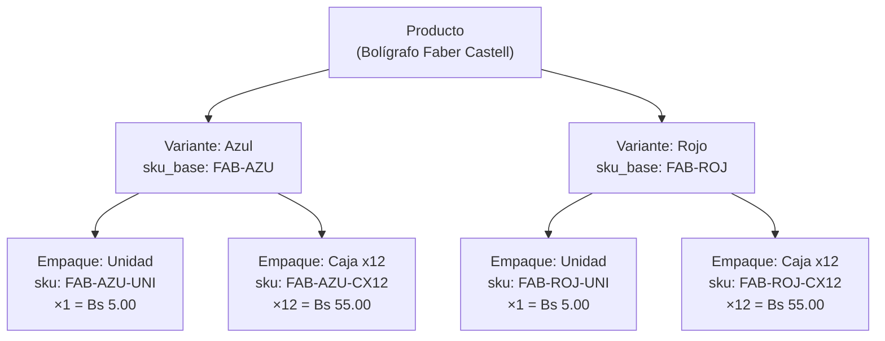

ok# 🔍 Análisis del Catálogo — Variantes y Empaques

## Arquitectura actual

La jerarquía `Producto → Variante → Empaque` es sólida. El esquema Prisma, los controladores, DTOs, repositorios y el frontend están conectados. Pero hay problemas reales que hay que resolver.

---

## 🔴 Crítico (rompe en producción)

### 1. BigInt sin serializar en `VariantesController`

**Archivo:** `apps/api/src/modules/catalogo/infrastructure/controllers/variantes.controller.ts`

El controller de Variantes devuelve los objetos crudos de Prisma sin convertir los `BigInt` a string/number. Cuando NestJS intenta hacer `JSON.stringify`, explota con `TypeError: Do not know how to serialize a BigInt`.

**Contraste:** `EmpaquesController` SÍ lo hace bien, mapeando `id: e.id.toString()`. Variantes no.

> ⚠️ Esto causa HTTP 500 silencioso al listar variantes desde el admin. Funciona "de casualidad" por el `BigInt.prototype.toJSON` global en `main.ts`, pero es frágil y no explícito.

---

## 🟠 Importante (causa bugs o deuda técnica real)

### 2. Sin validación de unicidad al crear Variante

**Archivo:** `apps/api/src/modules/catalogo/application/use-cases/variantes/crear-variante.use-case.ts`

`CrearEmpaqueUseCase` valida SKU duplicado y devuelve `BadRequestException`. `CrearVarianteUseCase` **no valida nada** — si mandás un `sku_base` o `nombre` duplicado, Prisma tira un error crudo de constraint (HTTP 500) en vez de un 400 controlado.

### 3. DTOs sin `@MaxLength`

**Archivos:** `apps/api/src/modules/catalogo/application/dtos/variante.dto.ts` · `empaque.dto.ts`

El schema Prisma pone `@db.VarChar(255)` en `nombre`, `sku_base`, `sku`, `codigo_barras`. Pero los DTOs solo validan `@IsString()` sin `@MaxLength(255)`. Si alguien manda 300 caracteres, pasa la validación de NestJS y explota en la DB.

### 4. URLs hardcodeadas a `localhost:3001`

| Archivo | Línea | Problema |
|---------|-------|----------|
| `apps/admin/.../VariantesSection.tsx` | ~90 | `fetch('http://localhost:3001/api/variantes/upload-imagen/...')` |
| `apps/frontend/.../producto/[id]/page.tsx` | ~25 | `fetch('http://localhost:3001/api/productos/...')` |
| `apps/frontend/.../material-escolar/page.tsx` | ~22 | `fetch('http://localhost:3001/api/productos')` |

En el deploy, estas rutas no van a existir. Deberían usar variable de entorno `NEXT_PUBLIC_API_URL`.

---

## 🟡 Mejoras (no rompen, pero vale la pena)

### 5. Creación masiva de variantes — loop de POSTs individuales

**Archivo:** `apps/admin/.../VariantesSection.tsx` ~línea 55

Al poner "Azul, Rojo, Negro" se hace un `for...of` con un `POST` por cada nombre. Si ponés 20 colores, son 20 requests secuenciales. Lo ideal sería un endpoint `POST /variantes/bulk`.

### 6. Referencia muerta a "presentaciones"

**Archivo:** `apps/frontend/.../producto/[id]/page.tsx`

Queda un comentario JSX: `{/* Variants / Presentaciones selector */}`. Es cosmético pero confunde.

### 7. Precisión de precios con `Number()`

**Archivo:** `apps/api/.../controllers/empaques.controller.ts`

Se castea `Decimal` a `Number()` para el JSON. JavaScript pierde precisión con decimales (famoso `0.1 + 0.2 = 0.30000000000000004`). Para un ERP financiero, lo más seguro es devolver los precios como string y parsear en el frontend con una lib como `Dinero.js`.

---

## ✅ Resumen de acciones

| # | Severidad | Acción | Esfuerzo |
|---|-----------|--------|----------|
| 1 | 🔴 | Serializar BigInt en `VariantesController` | 5 min |
| 2 | 🟠 | Validar unicidad en `CrearVarianteUseCase` | 10 min |
| 3 | 🟠 | Agregar `@MaxLength(255)` a DTOs | 5 min |
| 4 | 🟠 | Extraer URLs a variable de entorno | 15 min |
| 5 | 🟡 | Endpoint bulk para variantes | 20 min |
| 6 | 🟡 | Limpiar comentario viejo | 1 min |
| 7 | 🟡 | Devolver precios como string | 10 min |
