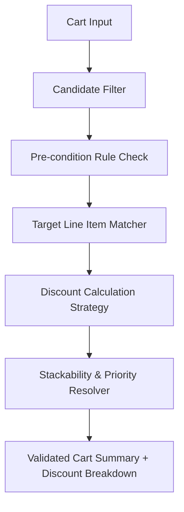

# Architectural Design: Enterprise Discounts Engine

## 1. Database Schema Extension (`schema.prisma`)

```prisma
enum CanalDescuento {
  POS
  ECOMMERCE
  TODOS
}

model Descuento {
  id                    BigInt           @id @default(autoincrement())
  nombre                String           @db.VarChar(255)
  descripcion           String?          @db.Text
  codigo_cupon          String?          @unique @db.VarChar(100)
  tipo                  TipoDescuento    @default(PORCENTAJE)
  valor                 Decimal          @default(0) @db.Decimal(14, 2)
  max_monto_descuento   Decimal?         @db.Decimal(14, 2)
  alcance               AlcanceDescuento @default(GLOBAL)
  canal                 CanalDescuento   @default(TODOS)
  
  cantidad_requerida    Int              @default(1)
  cantidad_paga         Int              @default(1)
  monto_minimo_compra   Decimal?         @db.Decimal(14, 2)
  limite_usos_totales   Int?
  limite_usos_por_cliente Int?          @default(1)
  usos_actuales         Int              @default(0)
  
  es_acumulable         Boolean          @default(false)
  prioridad             Int              @default(0)

  fecha_inicio          DateTime
  fecha_fin             DateTime
  activo                Boolean          @default(true)

  creado_en             DateTime         @default(now())
  actualizado_en        DateTime         @updatedAt

  productos             DescuentoProducto[]
  variantes             DescuentoVariante[]
  empaques              DescuentoEmpaque[]
  categorias            DescuentoCategoria[]
  usos                  DescuentoUso[]

  @@map("descuentos")
}

model DescuentoVariante {
  id           BigInt    @id @default(autoincrement())
  descuento_id BigInt
  variante_id  BigInt
  descuento    Descuento @relation(fields: [descuento_id], references: [id], onDelete: Cascade)
  variante     Variante  @relation(fields: [variante_id], references: [id], onDelete: Cascade)
  @@unique([descuento_id, variante_id])
  @@map("descuento_variantes")
}

model DescuentoEmpaque {
  id           BigInt    @id @default(autoincrement())
  descuento_id BigInt
  empaque_id   BigInt
  descuento    Descuento @relation(fields: [descuento_id], references: [id], onDelete: Cascade)
  empaque      Empaque   @relation(fields: [empaque_id], references: [id], onDelete: Cascade)
  @@unique([descuento_id, empaque_id])
  @@map("descuento_empaques")
}

model DescuentoUso {
  id               BigInt    @id @default(autoincrement())
  descuento_id     BigInt
  venta_id         BigInt
  cliente_id       BigInt?
  monto_descontado Decimal   @db.Decimal(14, 2)
  creado_en        DateTime  @default(now())

  descuento Descuento @relation(fields: [descuento_id], references: [id], onDelete: Cascade)
  venta     Venta     @relation(fields: [venta_id], references: [id], onDelete: Cascade)
  cliente   Cliente?  @relation(fields: [cliente_id], references: [id], onDelete: SetNull)

  @@map("descuento_usos")
}
```

## 2. Pipeline & Strategy Architecture for `DiscountEngineService`



### Strategy Implementations:
1. **`PercentageStrategy`**: Calculates percentage over matching items; applies `max_monto_descuento` ceiling if set.
2. **`FixedAmountStrategy`**: Deducts fixed amount proportionally across matching target items.
3. **`BuyXGetYStrategy`**: Filters matching items, orders by `precio_unitario` ascending, and applies 100% discount on the lowest priced `(cantidad_requerida - cantidad_paga)` units per bundle.
